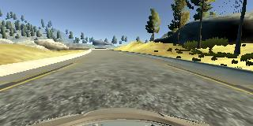
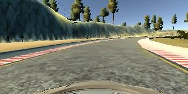
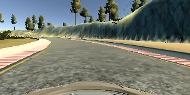

# **Behavioral Cloning** 

**Behavioral Cloning Project**

The goals / steps of this project are the following:
* Use the simulator to collect data of good driving behavior
* Build, a convolution neural network in Keras that predicts steering angles from images
* Train and validate the model with a training and validation set
* Test that the model successfully drives around track one without leaving the road
* Summarize the results with a written report


## Rubric Points
### Here I will consider the [rubric points](https://review.udacity.com/#!/rubrics/432/view) individually and describe how I addressed each point in my implementation.  

[model.py]: ./model.py
[drive.py]: ./drive.py
[model.h5]: ./model.h5

---
### Foreword

I used pipenv for training the model and executing the simulator on my local machine.

I imitated environment.yml in [CarND-Term1-Starter-Kit](https://github.com/udacity/CarND-Term1-Starter-Kit) provided by Udacity, so I think the environmental difference between my local machine and Udacity workspace is small.

### Files Submitted & Code Quality

#### 1. Submission includes all required files and can be used to run the simulator in autonomous mode

My project includes the following files:
* README.md summarizing the results (you're reading it)
* [preprocess.py](preprocess.py) for preprocessing image data used by both model training and autonomous driving
* [model.py](model.py) containing the script to create and train the model
* [drive.py](drive.py) for driving the car in autonomous mode
* [model.h5](model.h5) containing a trained convolution neural network 
* [video.mp4](video.mp4) containing a driving video in autonomous mode

#### 2. Submission includes functional code
Using the Udacity provided simulator and my drive.py file, the car can be driven autonomously around the track by executing 
```sh
python drive.py model.h5
```

#### 3. Submission code is usable and readable

The [model.py](model.py) file contains the code for training and saving the convolution neural network. The file shows the pipeline I used for training and validating the model, and it contains comments to explain how the code works.


### Model Architecture and Training Strategy

#### 1. An appropriate model architecture has been employed

The model definition is located in [model.py](model.py) lines 124-165.
The model consists of a convolutional neural network.

The convolutional layers are 3x3 filter sizes and their depths are between 32 and 512 ([model.py](model.py) lines 131-146), and max pooling layers are used.
After that, there are fully connected layers which output sizes are between 1024 and 64.
The model uses RELU layers for activation to introduce nonlinearity.

The image data is preprocessed by the function `preprocess()` ([preprocess.py](preprocess.py)) before input into the network.
Preprocessing consists of cropping, resizing, standardization.
Thus, I inserted preprocess code into [drive.py](drive.py) line 66.


#### 2. Attempts to reduce overfitting in the model

The model contains batch normalization layers in order to reduce overfitting ([model.py](model.py) lines 133, 137, 153).
Batch normalization layers are inserted after each convolutional layer and fully connected layer.
The paramaters for batch normalization are used the default ones.

The model was trained and validated on different data sets to ensure that the model was not overfitting (code line 57).
The model was tested by running it through the simulator and ensuring that the vehicle could stay on the track.


#### 3. Model parameter tuning

The model used an adam optimizer, so the learning rate was not tuned manually ([model.py](model.py) line 163).


#### 4. Appropriate training data

Training data was chosen to keep the vehicle driving on the road.
I used a center driving data created by myself and project provided dataset.


### Architecture and Training Documentation

#### 1. Solution Design Approach

My first step was to use a convolution neural network model based on several convolution layers and max pooling.
It was a basic model I used many time for solving the comupter vision tasks, so I chose it for a starting point.

In order to gauge how well the model was working, I split my image and steering angle data into a training and validation set.
To combat the overfitting, I used batch normalization layer implemented in keras.
Batch normalization and dropout techniques cannot be used together, so I used only batch normalization.

However, I realized it was too complicated for me to accomplish all preprocessing tasks I wanted on keras lambda layers.
Also, I suffered from out of memory error of GPU and failed to make network deep enough.
Thus, I decided to use the plain function to apply preprocessing to images, which would offload preprocessing from GPU and reduce GPU memory usage.
This enabled the network to deeper and made my code simple and clean.

The final step was to run the simulator to see how well the car was driving around track one.
The vehicle is able to drive autonomously around the track without leaving the road.

<!-- #region -->
#### 2. Final Model Architecture

The final model architecture ([model.py](model.py) lines 128-169) consisted of a convolution neural network with the following layers and layer sizes.


| Layer               | Output Size | Description                                    |
| :------------------ | :---------- | :--------------------------------------------- |
| Input               | 40x160x3    |                                                |
| Convolution         | 40x160x32   | (3x3x32) filter / (1x1) stride / SAME padding  |
| Batch Normalization | 40x160x32   | default parameters                             |
| ReLU                | 40x160x32   |                                                |
| Convolution         | 40x160x32   | (3x3x32) filter / (1x1) stride / SAME padding  |
| Batch Normalization | 40x160x32   | default parameters                             |
| ReLU                | 40x160x32   |                                                |
| Max Pooling         | 20x80x32    | (2x2) kernel / (2x2) stride / VALID padding    |
| Convolution         | 20x80x64    | (3x3x64) filter / (1x1) stride / SAME padding  |
| Batch Normalization | 20x80x64    | default parameters                             |
| ReLU                | 20x80x64    |                                                |
| Convolution         | 20x80x64    | (3x3x64) filter / (1x1) stride / SAME padding  |
| Batch Normalization | 20x80x64    | default parameters                             |
| ReLU                | 20x80x64    |                                                |
| Max Pooling         | 10x40x64    | (2x2) kernel / (2x2) stride / VALID padding    |
| Convolution         | 10x40x128   | (3x3x128) filter / (1x1) stride / SAME padding |
| Batch Normalization | 10x40x128   | default parameters                             |
| ReLU                | 10x40x128   |                                                |
| Convolution         | 10x40x128   | (3x3x128) filter / (1x1) stride / SAME padding |
| Batch Normalization | 10x40x128   | default parameters                             |
| ReLU                | 10x40x128   |                                                |
| Max Pooling         | 5x20x128    | (2x2) kernel / (2x2) stride / VALID padding    |
| Convolution         | 5x20x256    | (3x3x256) filter / (1x1) stride / SAME padding |
| Batch Normalization | 5x20x256    | default parameters                             |
| ReLU                | 5x20x256    |                                                |
| Convolution         | 5x20x256    | (3x3x256) filter / (1x1) stride / SAME padding |
| Batch Normalization | 5x20x256    | default parameters                             |
| ReLU                | 5x20x256    |                                                |
| Max Pooling         | 2x10x256    | (2x2) kernel / (2x2) stride / VALID padding    |
| Convolution         | 2x10x512    | (3x3x512) filter / (1x1) stride / SAME padding |
| Batch Normalization | 2x10x512    | default parameters                             |
| ReLU                | 2x10x512    |                                                |
| Convolution         | 2x10x512    | (3x3x512) filter / (1x1) stride / SAME padding |
| Batch Normalization | 2x10x512    | default parameters                             |
| ReLU                | 2x10x512    |                                                |
| Max Pooling         | 1x5x512     | (2x2) kernel / (2x2) stride / VALID padding    |
| Flatten             | 2560        |                                                |
| Fully Connected     | 1024        |                                                |
| Batch Normalization | 1024        | default parameters                             |
| ReLU                | 1024        |                                                |
| Fully Connected     | 256         |                                                |
| Batch Normalization | 256         | default parameters                             |
| ReLU                | 256         |                                                |
| Fully Connected     | 64          |                                                |
| Batch Normalization | 64          | default parameters                             |
| ReLU                | 64          |                                                |
| Fully Connected     | 1           |                                                |
<!-- #endregion -->

<!-- #region -->
#### 3. Creation of the Training Set & Training Process

To capture good driving behavior, I first recorded two laps on track one using center lane driving. Here is an example image of center lane driving:



To augment the data set, I flipped images and angles.
This would generalizing dataset because the road of track one is counter-clockwise, which might contain biases.
For example, here is an image that has then been flipped (left is raw, right is flipped):




Using the collected data and the project provided data, I had 21078 number of data points.
I then preprocessed this data by calling `preprocess()` ([preprocess.py](preprocess.py)).

Preprocessing consists of three steps:

* Raw image: 


1. cropping: cut top and bottom parts
   

2. resizing: shrink to 0.5x size
   

3. standardization: standardize values to [-1.0,1.0] range
<!-- #endregion -->

I finally randomly shuffled the data set and put 10% of the data into a validation set. 

I used this training data for training the model.
The validation set helped determine if the model was over or under fitting.
I set the number of epoch to 20 and used EarlyStopping callback to achieve early stopping in keras, resulted in stopping at epoch 8.

I used an adam optimizer so that manually training the learning rate wasn't necessary.
